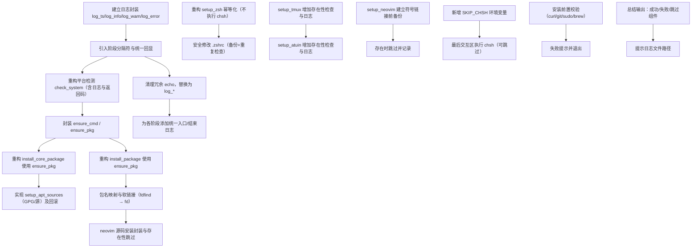

# dotfiles 安装脚本优化任务拆解（main）

本任务基于以下文档：`/specsai/init.md`、`/specsai/constitution.md`、`/specsai/main/plan.md`。当前无 `/specsai/main/prd.md`，按照用户需求与已完成的设计方案进行拆解。

## 任务依赖图（mermaid）

## 原子任务列表（按依赖排序）

1. 建立日志封装函数【已完成】
- 内容：新增 `log_ts`, `log_info`, `log_warn`, `log_error` 四个函数并在脚本顶部定义 `LOG_FILE`。
- 产出：统一时间戳与 tee 追加的日志输出。
- 状态：已在 `install.sh` 顶部实现并替换关键输出。

2. 引入统一回显（去除冗余格式化）【已完成】
- 内容：统一使用 `log_*` 输出，移除多余的分隔符与装饰性格式，保持简洁。
- 依赖：任务1

3. 重构平台检测 `check_system`【已完成】
- 内容：保留现有检测逻辑，增加 `log_info`、错误时 `exit 1`，返回码检查。
- 依赖：任务2

4. 封装命令/包安装检查 `ensure_cmd`/`ensure_pkg`【已完成】
- 内容：
  - `ensure_cmd <name>`：检查命令存在，不存在则报错或触发安装。
  - `ensure_pkg <pkg>`：按平台执行 `brew install` / `dnf install` / `apt install`，已安装则跳过。
- 依赖：任务3

5. 重构 `install_core_package`【已完成】
- 内容：改为依赖 `ensure_pkg` 安装通用工具（curl/unzip/zsh/tmux/ag/eza/bat/fd等），按平台包名映射。
- 依赖：任务4

6. 重构 `install_package`【已完成】
- 内容：改为依赖 `ensure_pkg` 安装扩展工具（ripgrep/shfmt/atuin/neovim等），并封装 neovim 源码安装路径。
- 依赖：任务4

7. 实现 `setup_apt_sources`【已完成】
- 内容：将 Debian/Ubuntu 的 GPG key 与源添加流程独立为函数；失败回滚并提示。
- 依赖：任务5 或 6

8. 包名映射与兼容软链接处理【已完成】
- 内容：`fd-find` 与 `fdfind` 的软链接到 `fd`；`silversearcher-ag`/`the_silver_searcher` 的差异处理。
- 依赖：任务5 或 6

9. neovim 源码安装封装【已完成】
- 内容：存在 `nvim` 则跳过；否则 clone stable 构建安装；失败 `log_error` 并退出或提示手动。
- 依赖：任务6

10. 清理冗余 `echo`【已完成】
- 内容：统一替换为 `log_*`，移除无用代码路径。
- 依赖：任务2

11. 阶段统一入口/结束日志【已完成】
- 内容：为 `setup_zsh/setup_tmux/setup_atuin/setup_neovim` 以及安装阶段增加统一的入口与结束日志。
- 依赖：任务10

12. 重构 `setup_zsh` 幂等化【已完成】
- 内容：`oh-my-zsh` 不存在则 `--unattended` 安装；插件存在性检查；不执行 `chsh`；`.zshrc` 备份与重复追加防护。
- 依赖：任务11

13. 安全修改 `.zshrc`【已完成】
- 内容：在末尾追加环境变量与别名时检测是否已存在；必要时备份原文件。
- 依赖：任务12

14. `setup_tmux` 增强【已完成】
- 内容：存在性检查与日志；保持原有链接与拷贝逻辑。
- 依赖：任务11

15. `setup_atuin` 增强【已完成】
- 内容：命令存在性检查与日志；失败不致命，仅 `log_warn`。
- 依赖：任务11

16. `setup_neovim` 增强【已完成】
- 内容：符号链接前备份；存在时跳过并记录。
- 依赖：任务11

17. 新增环境变量 `SKIP_CHSH`【已完成】
- 内容：读取 `SKIP_CHSH` 控制是否跳过默认 shell 切换；默认执行。
- 位置：已在 `install.sh` 最终交互区读取并生效。

18. 最后交互区执行 `chsh`【已完成】
- 内容：检测 zsh 路径（`/usr/local/bin`/`/usr/bin`/`/bin`）；询问并在最后执行；或因 `SKIP_CHSH` 跳过。
- 位置：已移动至 `install.sh` 末尾的“Final interactive”块。

19. 安装前置校验【已完成】
- 内容：检查 `curl/git/sudo`（Linux）与 `brew`（macOS）；缺失时报错并退出。
- 依赖：任务3

20. 执行总结输出【已完成】
- 内容：打印成功安装的组件列表与失败/跳过项，提示日志文件路径。
- 依赖：任务18

<!-- 根据用户要求，此任务规划不包含单元测试与集成测试章节。 -->
